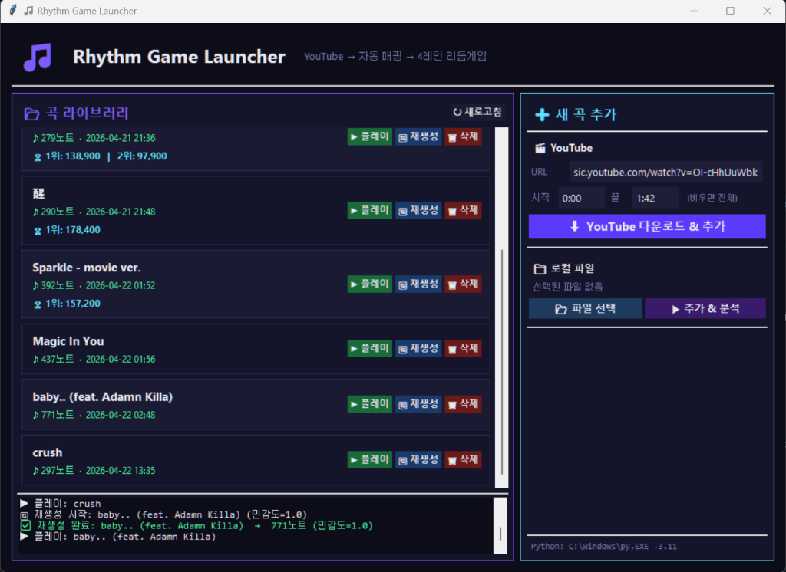
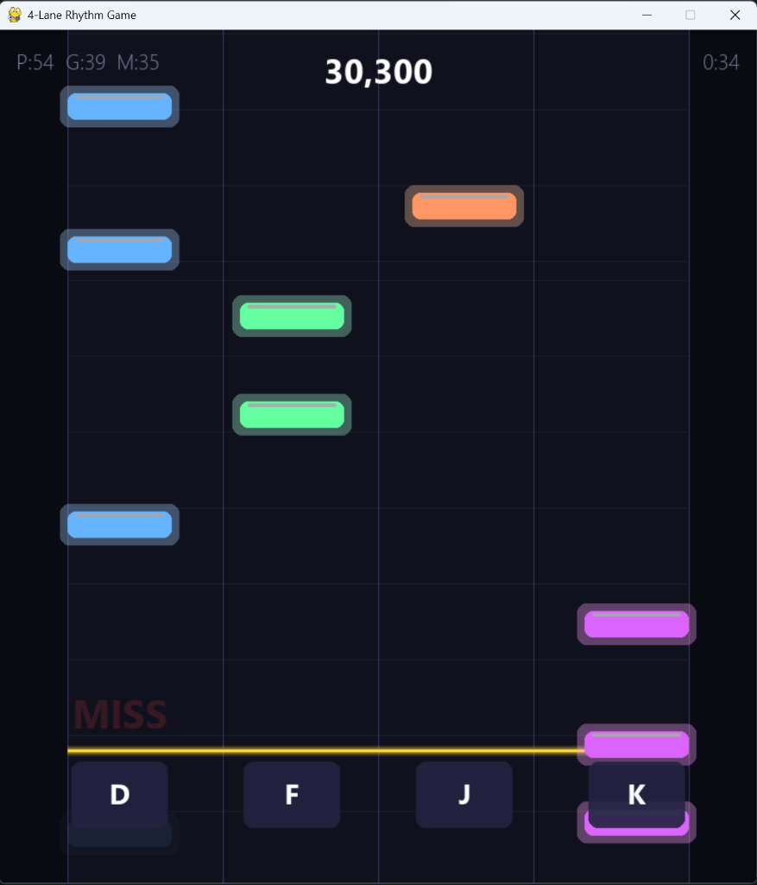

# rtgpy (Rhythm Game based on Pygame)

A 4-lane rhythm game in Python that automatically generates beat maps from any YouTube URL or local audio file.

## Features
- **YouTube Integration**: Simply paste a YouTube link and the game will automatically download the audio using `yt-dlp`.
- **Auto-Mapping**: Utilizes `librosa` to analyze the audio and generate precise 4-lane beat maps dynamically.
- **BPM-Adaptive Difficulty**: The mapping algorithm intelligently adjusts note density based on the song's BPM to ensure fast songs remain physically playable while slow songs remain engaging.
- **Built-in Launcher**: A sleek Tkinter GUI to manage your song library, remap note densities, and track your top 3 high scores per song.
- **Polished Gameplay**: Enjoy smooth 60 FPS gameplay, dynamic visual effects, combo multipliers, and realtime score popups.

## Screenshots

### Launcher


### Gameplay


## Installation

1. Clone the repository:
   ```bash
   git clone https://github.com/vividhyeok/rtgpy.git
   cd rtgpy
   ```

2. Install dependencies:
   ```bash
   pip install -r requirements.txt
   ```
   *Requires Python 3.11+ and `ffmpeg` installed on your system for audio processing.*

## Usage

Start the launcher:
```bash
python launcher.py
```
- Add a new song via YouTube URL or Local File.
- Click `Play` to launch the game.
- Use `D`, `F`, `J`, `K` to hit the notes!
